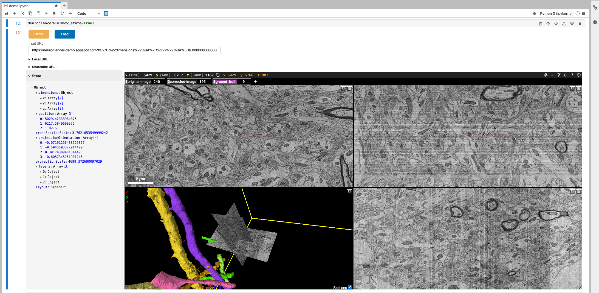
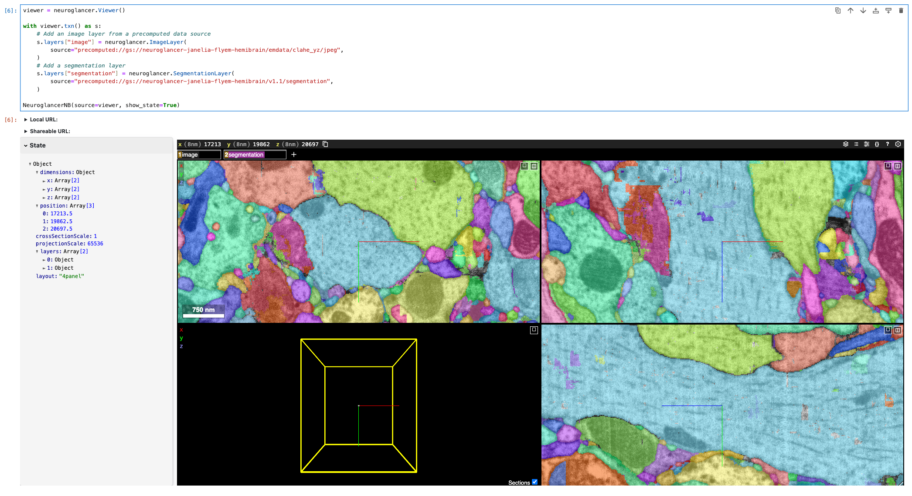

# `panel-neuroglancer` 
Use [`panel`](https://panel.holoviz.org/) to embed [neuroglancer](https://www.github.com/google/neuroglancer) in Jupyter notebooks.

## Usage
### Option 1 - Load from a neuroglancer url:
Either use `NeuroglancerNB(source=<URL>)` or just run `NeuroglancerNB()` and input the URL in the GUI:



### Option 2 - Load from `neuroglancer.Viewer` instance:

```python
viewer = neuroglancer.Viewer()

with viewer.txn() as s:
    # Add an image layer from a precomputed data source
    s.layers["image"] = neuroglancer.ImageLayer(
        source="precomputed://gs://neuroglancer-janelia-flyem-hemibrain/emdata/clahe_yz/jpeg",
    )
    # Add a segmentation layer
    s.layers["segmentation"] = neuroglancer.SegmentationLayer(
        source="precomputed://gs://neuroglancer-janelia-flyem-hemibrain/v1.1/segmentation",
    )
NeuroglancerNB(source=viewer, show_state=True)
```
